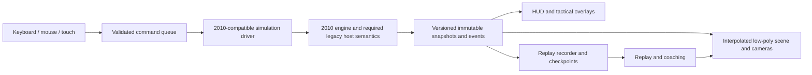

# Tact 2026: product and engineering plan

Status: implementation baseline; progress and task evidence are tracked in `todo.md`.
Created: 2026-10-05. Preservation reference: commit `64d5cdf`.
Execution tracker: [todo.md](todo.md). Task IDs in this plan refer to that tracker.

Browser scope decision, 2026-10-05: desktop Chrome for current development and
acceptance; the user's Pixel 11 with Chrome is the later physical touch target.
Firefox/Safari qualification is deferred. See the
[recorded decision](versions/2026/docs/browser-targets.md) and
[frozen acceptance contract](versions/2026/config/acceptance.json).

## 1. Purpose and product promise

Build a modern browser sailing tactics simulator around the reconstructed 2010
simulation. Players should spend their attention on wind, current, boat handling
and opponents. Clear low-poly graphics, smooth cameras and understandable controls
should make those decisions easier to see and practice.

The five product pillars are smooth presentation, better cameras, clearer
controls, optional tactical overlays, and replay/coaching. All five belong in the
MVP, with deliberately limited content and a complete playable race.

“2026” describes the presentation and product experience. The MVP uses the
preserved 2010 simulation and rules behavior. Updating the rules to a newer rule
book, rewriting opponents or changing hydrodynamics would be separate simulation
projects with their own profiles and validation. We must not imply that the
historical rules engine implements current competition regulations.

Keep the 2002 and 2010 editions available at their existing routes. Develop the
modern application under `versions/2026/`, with separate preferences, replay
storage, build output and documentation. Reuse the verified 2010 code through an
adapter; avoid an independent copy that silently drifts from its reference.

## 2. What we have, and what is still uncertain

The existing player uses JavaScript translations of original Windows GDI drawing
calls through Canvas 2D. It draws into an offscreen buffer and copies that buffer
to the visible canvas. The simulation already contains boat dynamics, steering,
opponents, wind, current, course setup, penalties and race state.

The latest [Canvas investigation](versions/2010-en/analysis/evaluation/CANVAS-FIX.md)
isolated a font-atlas transfer stall. Its instrumented median final draw cost fell
from 58.8 ms to 1.0 ms. The longer controlled speed-10 evaluation measured
33.7–39.7 observed FPS for 2010 and a median per-run p95 camera response of
111.5 ms. All 57 evaluation tests, HUD checks, 160 native font comparisons and the
real Canvas engine-parity gate passed. These are recorded finite results, not a
claim that every race or browser has been verified.

The most important architectural constraint is that rendering and simulation
are coupled. [The paint lifecycle](versions/2010-en/src/render/paint-lifecycle.js)
advances the simulation, composes drawings, runs timing behavior and clears
state. The drawing routines receive the simulation RNG and write memory;
[generated drawing code](versions/2010-en/src/render/drawing-functions.js) also
contains pixel reads. Replacing these calls with empty functions is unsafe until
their effects have been classified and compared.

Other unresolved baseline questions are complete-race stability, the meaning of
original speed levels, state needed for exact checkpoint restoration, side
effects of wind/current sampling, and compatibility with other browsers. The
first milestone turns these questions into measured contracts.

## 3. MVP scope

| Area | Required for MVP | Deferred expansion |
| --- | --- | --- |
| Content | Original Keelboat selector 12, Round Lake, windward/leeward course; default 15-boat fleet including the human player | Other polished boat classes, venues and course editor |
| Fleet | Select 5 or 15 boats; verify the inherited 30-boat case as a stress scenario | Larger fleets and new AI difficulty models |
| Race | Setup, forecast, prestart, racing, finish/results, restart; native wind/current and penalties | Championships, careers and online leaderboards |
| Graphics | Low-poly hull, articulated sails and simple crew; water, shoreline, marks, start line and readable wakes | Photorealism, weather cinematics, complex cloth and reflections |
| Cameras | Chase, tactical overhead and free spectator; synchronized course map | VR, cinematic editor and advanced camera choreography |
| Controls | Keyboard, mouse and landscape touch; steering, trim, shape and native maneuvers | Gamepad, portrait phone layouts and simultaneous local players |
| Tactical aids | Local wind, current, engine-backed disturbed-air indication, layline estimates and start timing | Advanced route optimization and exhaustive rules visualization |
| Replay | Record, save, load, seek, change playback speed, retry initial setup, and export/import a bounded replay | Cloud storage, arbitrary branching and online ghost races |
| Coaching | Three explainable local coaching categories and post-race timeline review | Generative/voice coaching, predicted optimal routes and causal time-loss claims |
| Delivery | Static browser build, desktop support, one validated landscape touch device; attribution and versioned data | Accounts, backend services, PWA/offline installation and app-store packaging |

The 2026 interface should expose only supported MVP content. Other inherited
engine options remain available in the preservation edition until their modern
models, controls and validation are ready. A 30-boat stress pass alone does not
make 30 boats a supported modern preset.

### Proposed initial scenario

Use Round Lake, Keelboat selector 12 and the existing windward/leeward course.
The original controlled evaluation uses area 5, venue 0, course 1 and fleet 15;
its existing setup commands are recorded in
[scenarios.js](tools/evaluation/scenarios.js). Verify these selections through
their original handlers before creating the modern scenario manifest.

Propose native pace level 5 for initial normal play, with levels 1, 5 and 10
available. This default remains provisional until the timing audit in `BASE-05`:
it must be usable and its actual simulation rate documented. Call these controls
**Simulation pace**, not “1×/5×/10×”, unless those wall-time ratios have actually
been implemented and verified. Preserve each level's original numerical step.

The proposed modern preset explicitly disables automatic foul slowdown for
continuous play. Provide a visible “Slow near likely fouls” setting that invokes
the original feature. Record the choice in scenario and replay manifests. The
2010 edition's defaults remain unchanged, and compatibility comparisons use
matching settings on both sides.

## 4. Player experience and race lifecycle

The main journey is **Choose race → Review conditions → Start → Sail → Finish →
Review → Retry or save replay**. Start the product with the sailing scene and a
compact race panel, rather than a separate promotional landing page.

Setup offers supported fleet size, native weather/current choices after their
mapping is verified, simulation pace and a repeatable initial scenario. Forecast
shows the current configuration, explains the controls and distinguishes known
initial conditions from uncertain future wind evolution.

The application has explicit states: loading, setup, prestart, racing, paused,
finished, replay and recoverable error. Each transition owns input activation,
worker scheduling, camera behavior, recording and audio. Results open from an
actual engine finish event; tests must never set a finisher flag to simulate a
completed race.

Pause stops simulation progression. Cameras can still be adjusted. Hiding the
page suspends simulation and rendering, clears held controls and rebases clocks
on resume without a catch-up burst. Opening settings pauses the live race for
MVP; help that does not capture inputs can be read without losing the scene.

Restart discards the active run only through a clear user action, closes its
recording and restores the chosen scenario. An error should retain the last good
state when possible and offer restart, export of diagnostic information or access
to the classic edition. It must not silently reset or continue a divergent race.

## 5. Architecture and simulation boundary

### 5.1 Responsibilities



The engine owns authoritative state. The application owns lifecycle and accepted
commands. The renderer owns meshes, materials, interpolation and cameras. A
renderer, map, overlay or coach must not write engine memory or consume its RNG.
The same engine snapshots must drive live and replay presentation.

### 5.2 Extract behavior before removing drawing

Inventory each frame phase: initialization, original controls, wind/AI/dynamics,
integration, drawing, input consumption, timers, history, retained locals and
cleanup. For drawing children, record memory writes, RNG calls, pixel reads,
callbacks and values consumed by later simulation steps.

Classify each effect as required simulation behavior, original control behavior,
presentation-only behavior or unresolved. The classification needs a reader/writer
trace and a reference comparison; a file named `render` is not evidence of purity.
Treat unresolved effects as authoritative until shown otherwise.

A compatibility bridge may initially retain a small canonical legacy surface and
the necessary drawing phases. Its cost is included in simulation measurements.
Such a bridge is a transition strategy, not an excuse to render the whole legacy
screen beside the new scene indefinitely. Pixel reads must receive equivalent
results; a trace-only/no-op GDI implementation is not a safe default replacement.

Keep a declared canonical legacy camera, surface, host clock and phase sequence
inside the simulation profile. Modern camera movement changes only presentation.
Do not assume arbitrary original camera changes were simulation-neutral; prove
the modern isolation against a reference using the same canonical host context.

### 5.3 Adapter API

Proposed operations are `initializeScenario`, `enqueueCommand`, `step`,
`readSnapshot`, `drainEvents`, `createCheckpoint`, `restoreCheckpoint` and
`dispose`. The adapter translates meaningful actions to verified original
handlers or extracted control operations. UI components contain no hard-coded
memory addresses and never create their own boat-dynamics implementation.

A command includes schema version, run ID, sequence, action, bounded parameters
and the accepted simulation tick/phase. Record acceptance, not just the time a
DOM event was produced. Reject commands from an old race/replay generation and
make queue overflow explicit. Coalesce continuous steering intent only according
to a documented, replayable policy; discrete tacks, trim steps and pause commands
must remain ordered.

Snapshots contain sequence/run IDs, engine tick and simulation time, native pace,
race phase, course/mark data, stable boat IDs and poses, verified wind/current
readouts, sail state, penalties, progress and data validity flags. Derive headings,
coordinate signs, distance and speed units from source/reference evidence.
Display-only unit conversion must not alter stored engine values.

Publish a small presentation snapshot, not the complete multi-megabyte memory
image on every display frame. Initial target: at most 32 KiB for the 15-boat
presentation snapshot. Authoritative checkpoint storage is a separate format.

### 5.4 Comparison contract

Start with exact legacy-versus-adapter mutable memory, RNG, retained state, host
clock and event comparisons at matched tick/phase boundaries. Once presentation
state is isolated, any excluded byte ranges need an explicit versioned allowlist,
a reason and evidence that they cannot influence the declared simulation state.
No numeric tolerance, expected-state injection or broad normalization may hide
an engine difference.

Existing native comparisons continue to validate the preserved engine. New
comparisons validate the modern driver and control mapping against that engine
under identical scenario and host inputs. Camera, overlay, device-pixel-ratio and
display-frequency changes must leave the authoritative timeline unchanged.

### 5.5 Worker and transport

Prefer a dedicated simulation worker after the semantic boundary is proven. Use
ordinary messages and transferables first so a static host needs no shared-memory
deployment configuration. Keep message buffers bounded and publish the latest
completed snapshots rather than an unlimited backlog.

Audit module-level DOM dependencies, retained frames, global arithmetic settings
and any Canvas host required by the compatibility bridge. Prototype worker
initialization and replay before making it the only runtime path. If the worker
cannot preserve required host behavior, the milestone remains blocked; a
main-thread spike can demonstrate functionality but must still pass performance
gates before release. Do not add a second engine implementation as a fallback.

## 6. Improvement one: smooth presentation

Separate display refresh from compatible simulation steps. Determine a logical
host/timing profile from the original code and fixtures rather than using the
display's `requestAnimationFrame` frequency as the physics clock. Preserve native
step arithmetic and speed-related state changes. Record both simulation seconds
per wall second and native pace in evaluations.

Render between the two latest completed snapshots using their actual simulation
timestamps. Interpolate positions and wrapped headings on a short presentation
buffer; do not assume a constant `dt`, interpolate through a teleport, or advance
the authoritative state to make motion appear smoother. Boat resets, race restarts,
replay seeks and discontinuities snap to the new state and reset the buffer.

Treat hull rotation, sail shape, boom rotation and simple crew poses similarly.
Cosmetic water, wake and ambient motion use a separate deterministic visual seed
or local visual clock. They never consume the original CRT RNG. Avoid speculative
extrapolation that might show an impossible collision or wrong mark rounding.

When simulation is late, render the latest valid state, expose the slowdown and
apply bounded scheduling/backpressure. Never skip authoritative steps, enlarge
`dt` or consume an unbounded catch-up loop silently. Prefer lower visual quality
before altering simulation fidelity. For live hidden-page resume, do no catch-up.

Measure the compatibility bridge, engine, transport, render CPU work and actual
GPU work separately where timing support exists. CPU time around a GPU draw call
does not measure deferred GPU completion. Profile separately from acceptance
timing, carrying forward the lesson from the Canvas font stall.

## 7. Low-poly art and rendering specification

### 7.1 Visual direction

Use a nautical palette and strong silhouettes. The memorable visual element is
the white, visibly trimmed sail moving above angular blue water. Keep HUD chrome
quiet and functional; avoid decorative cards, heavy bloom and tiny ornamental
details that compete with opponents and marks.

| Token | Proposed value | Role |
| --- | --- | --- |
| Deep water | `#123F58` | Distant/deeper water and depth contrast |
| Open water | `#177F9C` | Main sea plane |
| Sail / panel | `#F4F7F8` | Sails and readable instrument surfaces |
| Instrument ink | `#12303D` | Text, linework and boat details |
| Course amber | `#D99A20` | Marks, selected course features and emphasis |
| Warning red | `#B32635` | Penalties and actionable warnings |

These are starting tokens, not proof of contrast. Validate text/control
combinations, selected outlines and indicators against the changing scene.
Represent state with labels, icons and line styles as well as color.

Use IBM Plex Sans regular/semibold for a consistent instrument-like UI, with
tabular numerals where available, a system fallback and a local font asset with
its notices. Its UI suitability and source distribution are documented by
[IBM](https://github.com/IBM/plex). Proposed type sizes: 14 px secondary desktop
labels, 16 px controls/body, 22 px key readouts and 28 px race headings; touch
controls use at least 16 px labels. Do not shrink essential data to fit a phone.

### 7.2 Geometry and assets

Create one original low-poly keelboat model, with separate hull, deck, mast, boom,
main/jib sails, rudder where visible and a few simple crew forms. Preserve the
verified relationship between hull length, mark distance and course scale.
Document the original world-to-render transform and test axes using known points.

Use flat or restrained smooth shading, simple material colors, modest sail
curvature and clear tack/gybe changes. Cosmetic heel/pitch can use exposed engine
values; if an animation is illustrative rather than engine-derived, classify it
as such and keep it out of tactical measurements.

Use glTF/GLB for distributable models and retain editable source models alongside
them. Three.js provides [GLTFLoader](https://threejs.org/docs/pages/GLTFLoader.html).
The glTF specification uses meters and a right-handed coordinate system; put the
conversion from original units in one tested adapter rather than guessing it in
each asset. [Khronos specification](https://registry.khronos.org/glTF/specs/2.0/glTF-2.0.html)

Initial asset targets are a player model below 5,000 triangles, a distant opponent
model below 1,000, and shared materials across the fleet. These are working
budgets to validate, not claims that triangle count alone guarantees performance.
Repeated hulls/marks can use instancing; articulated sails may use individual
meshes. Three.js documents instancing for shared geometry/materials to reduce draw
calls. [InstancedMesh](https://threejs.org/docs/pages/InstancedMesh.html)

Build Round Lake's visual shoreline from authoritative venue geometry, with a
simple faceted land mesh, readable bank edge and restrained vegetation. Decorative
objects must not suggest navigable gaps or collision surfaces that the engine
does not recognize. Water height and visual shore crossings need alignment tests.

Water uses cheap animated normals or small vertex movement, restrained highlights
and a bounded wake pool. Avoid full fluid simulation, screen-space reflections
and per-boat reflection rendering. Wake widths communicate boats without being
mistaken for exact disturbed-air or current fields.

### 7.3 Renderer choice

Use Three.js behind a small renderer interface. Select `WebGLRenderer`/WebGL 2
as the proposed MVP production backend. Run a bounded WebGPU spike, but do not
make it an MVP dependency. Current Three.js documentation describes WebGPURenderer
as experimental, supports a WebGL 2 fallback, and recommends WebGLRenderer for
pure WebGL 2 applications. [Official renderer guide](https://threejs.org/manual/pages/webgpurenderer)

This refines the earlier WebGPU-first suggestion using the current documentation.
Pin the selected package version and lockfile during the spike. Reuse renderer
interfaces and asset contracts so a later backend change does not touch physics.
Custom water materials must be compatible with the selected backend; ordinary
GLSL material hooks do not automatically migrate to WebGPU's material system.

Start with ambient plus one directional light and selective or simplified
shadows. Use bounded LOD, device-pixel-ratio caps and explicit standard/low quality
settings. Avoid reallocating meshes, textures or materials each frame. Resize,
restart and replay seek must dispose/reuse resources predictably.

## 8. Improvement two: cameras and course map

**Chase:** follow the player at a stable distance and modest height, keeping sails,
nearby boats and the next course feature legible. Heading following should be
smooth, bounded and responsive during tacks. Support a configurable distance and
look-ahead. Reduced-motion mode removes decorative roll, bobbing and long swings.

**Tactical overhead:** use an orthographic or near-orthographic view with north-up
and boat-up choices. Course lines, wind/current arrows and boat IDs stay readable.
Pan, zoom and “Follow my boat” have clear controls. Distances must not be distorted
by an arbitrary map projection.

**Spectator:** free orbit/pan with a selected boat as an optional focus. Selection
does not transfer helm control or expose additional live tactical information
unless training mode allows it. Clamp zoom and movement so users cannot lose the
course indefinitely; provide an immediate recenter action.

Keep a compact course map visible in the racing layout. It uses the same snapshot
transform as the 3D scene, distinguishes player/opponents/marks, and shows the
current leg and start line. Do not add a second inconsistent boat-position source.

Reserve camera gestures for an explicit gesture region or camera mode; dragging
the scene to steer must not also orbit it. A gesture stays owned by the control
that captured it until pointer release/cancel. Camera changes are presentation
commands and never enter the sailing command log as helm actions.

## 9. Improvement three: controls and HUD

### 9.1 Layout

Use a large sailing viewport, a compact instrument strip, the course map at one
edge, and a bottom helm/trim area. A collapsible race panel holds results,
settings and assistance. Preserve visibility of the player and nearby boats;
support keyboard-accessible HTML controls instead of recreating every control
as canvas hit testing.

```text
┌ Race phase / countdown       Wind / pace       Pause / help ┐
│                                                            │
│                 Low-poly sailing scene          Course map │
│                                                            │
│ Camera: Chase · Tactical · Spectator       Tactical aids     │
├ Speed · wind angle · sail status · leg · position · warnings ┤
└ Steering / maneuvers          Sheet / shape controls         ┘
```

For landscape touch, move steering and trim to opposite lower corners and allow
the course map to collapse. Keep the center clear. In portrait, show a readable
rotate-device explanation with access to setup/results; portrait racing is not
an MVP commitment. Test resizing in both orientations without resetting the race.

### 9.2 Input semantics

Keep familiar original actions where their handlers are verified: steer left/right,
heading/point-of-sail actions, tack/gybe where available, sheet, sail shape,
pause/restart and simulation pace. Document each action's units, bounds, repeat
behavior and original control phase. Map keyboard and pointer/touch to the same
command interface so identical accepted commands produce identical state.

Use separate **Steer** and **Camera** modes for pointer gestures. Sheet and shape
use labeled controls with current values and keyboard adjustments. Avoid silent
auto-trim or auto-steering changes. Any inherited assistance is visible in setup
and recorded in the scenario.

Held keys/pointers are released on blur, hidden-page transition, modal opening,
pause and pointer cancellation. Steering must not remain active after a touch
leaves the screen. Focused sliders/buttons own their keyboard navigation;
shortcuts do not hijack typing or dialog interaction.

Immediate pressed-state feedback and camera movement can respond before the next
physics tick. Label queued versus applied trim/helm values if needed; do not show
a predictive value as authoritative boat state. Engine-backed values are updated
from snapshots, including speed, wind angle, sail/luff status, leg, position,
penalties and the next course target where the source mapping is verified.

### 9.3 Accessibility, sound and settings

Use visible focus, descriptive labels, sufficient contrast, at least 44 CSS px
primary touch hit targets and non-color indications for selection/warnings.
Race status changes should be announced sparingly; do not stream every numeric
update to screen readers. Reduced-motion settings apply to camera/ambient effects
while keeping the simulation and essential course information intact.

Offer sound off/on and volume with an explicit user gesture for browser audio.
Reuse suitable original sounds and add lightweight cues only if they clarify
start, penalty or finish. Spatial audio and continuous sailing ambience are
post-MVP. Persist preferences in a separate `tact-2026` namespace with a reset
action and schema migration; never modify the original 636-byte 2010 archive.

## 10. Improvement four: tactical overlays

Overlays are optional training information, driven by read-only snapshot data.
Group them into Wind, Current, Air, Course and Start, with an easy “Clean view”
action. Each has a legend, a validity state and a consistent counterpart on the
course map. Rendering or toggling an overlay cannot change the race timeline.

| Overlay | MVP behavior | Fidelity constraint |
| --- | --- | --- |
| Wind | Player's verified local direction/strength, shift history and sparse field arrows where safe sampling exists | Distinguish local boat wind from global/reference wind and apparent from true wind |
| Current | Verified direction/strength at the player; sparse spatial arrows if sampling is read-only | Preserve native tide/current calculations; decorative water is not current data |
| Air | Existing engine-backed clean/disturbed-air status and responsible boat if the engine exposes it | Do not invent a physics-accurate shaded wind cone from boat positions alone |
| Course | Next mark, leg/course guide and estimated laylines | Laylines are guidance, not proof of an optimal route under changing wind/current |
| Start | Engine countdown, start line and signed distance; line bias when verified | Distinguish a warning estimate from an engine-assessed early-start penalty |

Some environmental samplers mutate memory or retained state. Do not call them on
the live engine just to draw a grid. Use already exposed authoritative values or
sample an isolated clone with complete context and no observable live effects.
If a trustworthy disturbed-air field is unavailable, the mandatory MVP aid is the
engine's status indicator; a geometric cone is optional and explicitly illustrative.

Laylines use verified boat/mark positions and a documented sailing-angle model.
If a reliable original angle is not available, label the estimate and suppress it
when inputs are invalid. Avoid confident precision, stale arrows and arbitrary
fixed sailing angles presented as engine truth.

Historical tutorial material may inform concise help. Explain each aid in ordinary
sailing language and preserve the distinction between recorded rules behavior
and coaching advice. No overlay should require a second physics implementation.

## 11. Improvement five: replay and coaching

### 11.1 Recording and exact reconstruction

A replay stores format version, application/engine/data hashes, scenario settings,
initial mutable state and RNG, declared host/timing profile, accepted commands,
effective tick/phase, engine events and exact checkpoints. Visual preferences can
be recorded separately but are not inputs to boat dynamics.

The original `saveRaceState`/`restoreRaceState` operations are race-history
operations, not evidence of a complete replay snapshot. Audit all state affecting
future output: memory, RNG, original retained locals, logical host clock, driver
phase, accepted-command queue and relevant bindings. Exclude only caches proven
reconstructible without changing output. Arbitrary mid-frame checkpoints are
forbidden; capture at a declared completed tick boundary.

For floating-point and extended values, preserve binary/explicit representations;
do not coerce large integers to JavaScript numbers or normalize extended values
through ordinary JSON numbers. Checkpoints and replay imports have length,
schema, bounds and hash checks.
Unsupported engine versions need an explicit explanation, not playback under
whatever current code happens to be loaded.

Round-trip verification is **record → restore in fresh engine → apply the same
accepted commands → compare every authoritative boundary and finish event**.
Checkpoints are also tested by restoring several points and reaching the same
future hashes. Recordings from changed versions remain exportable even when the
current application cannot safely replay them.

### 11.2 Playback and storage

Replay UI provides play/pause, scrub/seek, previous/next decision event, playback
speed, camera switching and selected-boat inspection. Playback speed changes
delivery of recorded states, not their `dt` or command sequence. Backward seeks
start from a compatible checkpoint and invalidate outstanding worker results
using generation IDs. Disable sailing inputs in replay mode.

Persist local replays in a separate IndexedDB database, with JSON/container export
and import, title/date/course/finish metadata, deletion and a clear recording
indicator. Propose a 50 MiB per-replay storage/import cap and support up to 30
minutes of wall-time recording for the MVP reference scenario; measure before
finalizing the encoding and checkpoint cadence. Quota failure must not erase
other replays or crash the race. Offer export when persistence is unavailable.

Checkpoint interval is a measured compromise between storage and seek time.
Use exact deltas/compression only after round-trip checks. The reference seek
target is p95 below three seconds on a ten-minute recorded scenario. If this
cannot be achieved within the storage budget, record the blocker explicitly;
do not silently shorten recordings or claim instant seeking.

“Retry scenario” restores the same initial state, seed and setup. It does not
guarantee identical future weather after different player actions: shared RNG
consumption and feedback can change subsequent evolution. “Replay race” reproduces
the recorded commands and conditions. A future controlled-weather comparison
mode would require additional engine work and is outside MVP.

### 11.3 Explainable coaching

Use deterministic local rules over validated events and telemetry, without an
LLM service or external account. The three MVP categories are start execution,
sustained luffing/trim state, and observed wind shifts/tack timing. Each insight
shows its observation interval, units, threshold and source data.

Examples of appropriate output are “You crossed the line N seconds after the
start,” “Luffing remained above the configured threshold for this interval,” or
“The observed local wind direction changed around this tack.” Handle early
starts and unavailable telemetry explicitly. Thresholds are versioned coaching
settings, not undisclosed new sailing rules.

Do not claim “this cost two seconds” or “the other route was optimal” without a
valid counterfactual simulation. Local wind changes caused by disturbed air must
not be described as a global wind shift. Coaching can suggest what to inspect;
it cannot replace or contradict authoritative penalty/finish events.

Post-race review shows course track, selected boat, pace, key events and modest
speed/wind/luff charts. Clicking an insight seeks to its interval. A two-run review
can align by elapsed simulation time or course milestone and show the difference
in recorded tracks/results. Label changed conditions; do not treat two retries as
an experiment with identical future wind. Live ghost overlays are post-MVP.

## 12. Repository, build and data organization

The following layout is proposed, not a list of files that already exist:

```text
versions/2026/
  index.html
  package.json                   # isolated modern development dependencies
  src/
    app/                         # lifecycle, settings, run ownership
    simulation/                  # 2010 adapter, driver, commands, snapshots
    worker/                      # worker entry and bounded transport
    render/                      # Three.js scene, boats, water, interpolation
    cameras/                     # chase, overhead, spectator
    ui/                          # semantic HTML controls and course map
    overlays/                    # read-only wind/current/air/course/start aids
    replay/                      # recorder, checkpoints, persistence, playback
    coaching/                    # deterministic insights and review metrics
  assets/{models,fonts,audio}/
  scenarios/                     # versioned supported scenario manifests
  tests/                         # contracts, browser interactions, round trips
  analysis/                      # reproducible correctness/performance evidence
  docs/                          # architecture decisions and asset conventions
dist-2026/                       # generated static export
posey-2026-browser.zip            # generated downloadable export
```

Use TypeScript for new contracts/application modules while importing existing
JavaScript engine modules. Prefer a small Vite build and semantic DOM UI; React,
a full game engine and a backend are not MVP requirements. Pin dependencies and
preserve numerical behavior through production bundling. Avoid unsafe math
transformations or an unreviewed conversion of generated engine code.

Introduce root convenience commands only during implementation: `dev:2026`,
`build:2026`, `test:2026`, `check:play:2026` and `eval:2026`. The new export follows
the existing manifest/hash approach but verifies bundled modules, worker assets,
models and notices. It excludes EXEs, native fixtures, decompilation and analysis
data. Test the built output and ZIP, not only the development server.

## 13. Proposed performance and resource targets

These are engineering acceptance targets, not measurements of a built 2026 app.
Freeze the benchmark environment and budgets at milestone M0; changing a target
later requires a documented decision and retained before/after evidence.

| Metric | Desktop reference target | Qualification |
| --- | --- | --- |
| Display cadence | Approximately 60 changed render frames/sec at 60 Hz; median interval ≤18 ms, p95 ≤25 ms, p99 ≤50 ms | Live 15-boat race at declared viewport/quality; observe actual completed frames rather than counting callbacks alone |
| Camera/HUD input response | p95 <100 ms; aim ≤50 ms | Trusted input to changed completed frame observed at rendering opportunity; not a monitor-latency claim |
| Helm/trim application | By the next documented eligible original control phase, with ≤50 ms host overhead | Measure separately from immediate UI feedback; native tick delay and deliberate slowdown are explicit |
| Simulation invariance | Exact declared authoritative state, RNG and events for matching inputs | Display refresh/camera/quality changes cannot change the timeline |
| Snapshot transport | Presentation snapshot ≤32 KiB at 15 boats; bounded queues | Measure allocation, transfer and dropped presentation updates without dropping simulation steps |
| Startup download | ≤8 MiB compressed first-race resources | Count HTML, JS, worker, engine data, models and fonts; do not omit engine dependencies |
| Ready to interact | ≤5 seconds under a declared 20 Mbps / 50 ms RTT test profile | Also preserve an unthrottled measurement and explicit loading/error states |
| GPU scene complexity | Working budget ≤200 draw calls and ≤150,000 visible triangles for the reference scene | Measure map, shadows, wakes and overlays; these budgets do not substitute for cadence tests |
| Resource lifecycle | No accumulating resources across restart/seek; settled memory within 10% of warmed baseline after repeated cycles | Allow normal bounded caches and transient peaks; report JS and GPU counts separately where possible |
| Replay seek | p95 <3 seconds for a ten-minute reference recording | Exact restore/resimulation; recording/import cap and device are declared |
| Landscape touch | ≥30 changed render FPS, p95 interval ≤50 ms, UI response p95 <150 ms on one named physical device | Low quality is allowed and recorded; touch is a separate acceptance lane |

The initial desktop reference is the existing Linux system with Ryzen 7 5700G,
RX 7800 XT and headed GPU Chrome. Retain the verified physical 1280×1051 test
window and logical 1280×1050 viewport where practical, and record the modern
canvas's actual backing/CSS size, pixel ratio and quality. New 2026 regressions
require a fresh baseline for that surface; they cannot reuse the 2010 canvas's
dimensions as if the workloads were identical.

At a 240 Hz desktop refresh, cap desired render frequency around 60 for the
reference lane and record that cap. Callback rate alone is never a success
metric. Separate warm-up from timed frames and profiling from acceptance runs.
GPU timings may be unavailable or disjoint; mark them unavailable rather than
substituting CPU draw-call duration.

## 14. Verification and evaluation cycle

### Correctness layers

1. Preserve existing 2002/2010 tests and published native references.
2. Compare the new driver, control phases and worker against the 2010 reference.
3. Verify world-unit conversion, stable IDs and snapshot validity.
4. Prove that rendering, overlays, cameras and display frequency are read-only.
5. Verify checkpoint restoration, imported recordings and deterministic replay.
6. Exercise trusted keyboard/mouse/touch controls against actual rendered UI.
7. Complete races from setup to real finish/results and verify restart/save/reload.
8. Run the same critical checks against the static export and packaged ZIP.

Preserve failing runs and source/data/collector hashes. Do not change expected
native fixture bytes to make an extraction pass. Compare event ordering and
finish timing as well as boat positions. A complete race is a real engine
progression, never a manually prepared results-screen input.

### Scenario matrix

| Lane | Required cases |
| --- | --- |
| Reference play | Round Lake, 15 Keelboats, native pace 5, automatic slowdown off; complete race |
| Small fleet | Same setup with 5 boats; initialization, controls, finish and replay |
| Pace | Original levels 1, 5 and 10; pace changes mid-race and deliberately enabled foul slowdown |
| Environment | Existing supported wind/current configurations, including at least one nonzero current and wind-shift case |
| Interaction | Tack/gybe where supported, trimming, cancellation, pause/settings, camera changes, overlays and hidden-page resume |
| Engine boundaries | Start-line/early-start, penalty, mark rounding, finish, restart and retained-state paths identified in the baseline audit |
| Stress | 30-boat original case; resource limits and graceful slowdown; not automatically a supported MVP option |
| Replay | Fresh reconstruction, several checkpoint restores, backward/forward seek, imported incompatible/corrupt recording and full finish |
| Session | Three independent real start-to-finish runs plus a 30-minute wall-time mixed session with repeated restarts/seeks |
| Browsers | Named current desktop Chrome; user's Pixel 11 with Chrome for later physical landscape-touch validation; Firefox/Safari deferred |

Test 2026 at 30, 60, 120 and 240 Hz presentation schedules where controllable,
with the same logical engine commands. Emulated schedules are determinism tests;
they do not prove those physical refresh rates or mobile GPU performance.

### Repeatable performance cycle

Reuse the principles in [the current evaluation guide](tools/evaluation/README.md):
fresh profiles, controlled original setup, source pins, stable browser/GPU/window
context, actual visibility, five repeated runs and retained outliers. Add separate
lanes for GPU rendering, worker progression, camera input, helm application and
replay seek. Frame/time budgets must be stated, not reduced after a failure.

For each optimization, identify one bottleneck, make one bounded change, rerun
correctness, then collect new unprofiled timing. Dynamic quality changes are
recorded and cannot conceal a failure at the declared reference quality. Loaded
desktop diagnostic runs do not become idle-desktop acceptance evidence.

## 15. Milestones and implementation order

| Milestone | Deliverable | Exit condition | Main tracker groups |
| --- | --- | --- | --- |
| M0: reference and decisions | Frozen scenario/host contract, full-race baseline, renderer/worker spikes, art/UI specification | Couplings and timing are documented; blockers have reproducible evidence | BASE, first ENG/GFX/UI tasks |
| M1: reusable simulation | Verified driver/commands/snapshots, worker transport, complete checkpoint prototype | Exact comparisons pass; presentation frequency and camera changes cannot change declared simulation state | ENG, APP, RPL-01 through RPL-03 |
| M2: playable vertical slice | Low-poly Round Lake race, articulated keelboat fleet, chase/tactical view, functional helm/HUD | A real complete race is playable through modern controls and results, and is recorded/reconstructed correctly | GFX, CAM, UI, early RPL |
| M3: all five pillars | Spectator/map, tactical aids, persistent replay/seek/review and three coaching categories | Every promised MVP feature has browser-level functional and fidelity evidence | CAM, OVL, RPL, COA |
| M4: release hardening | Desktop/touch compatibility, repeatable timing, long sessions, verified static export/ZIP | Required tracker tasks and release matrix pass; remaining limitations are documented | QA, REL |

The critical path is baseline semantics → compatible simulation driver and
checkpoint restoration → real modern race with exact recording → review/coaching
→ release gates. Complete `RPL-01` through `RPL-03` before closing M1;
`RPL-04` and `RPL-05` supply the recording/reconstruction evidence required by M2.
Art and layout work can start after asset/world conventions are known, but must
not be mistaken for a working modern simulation. The first playable delivery is
M2; the MVP release includes M3 and M4.

Use task sizes as effort categories, not calendar promises. Re-estimate after
the M0 spikes: extraction of original drawing effects and exact checkpointing
are the largest uncertainties. If a required feature cannot meet its contract,
record the blocker and a concrete scope decision rather than silently shipping
a narrower product under the same MVP definition.

## 16. Risks, decisions and mitigations

| Risk | Required response | Decision owner / gate |
| --- | --- | --- |
| Drawing changes future state/RNG | Phase inventory, canonical legacy host, exact paired traces and a measured bridge | ENG before M1 exit |
| Pixel reads require a raster surface | Preserve equivalent CPU surface behavior until replacement is proven | ENG/GFX spike |
| Speed labels do not mean wall-time multipliers | Audit native steps/host clock, expose honest pace labels and measure simulation rate | BASE before default selection |
| Original history snapshot is incomplete | Complete state inventory, fresh-engine restore and future-hash checks | RPL before persistence/seek |
| Renderer backend compatibility/performance differs | WebGL 2 MVP, pinned dependency, bounded WebGPU spike and recorded choice | GFX before production integration |
| Sampling overlays mutates the live engine | Read-only exports or isolated clone with proof; suppress unavailable fields | OVL before feature acceptance |
| Visual coast/model scale conflicts with simulation | Central unit conversion, authoritative geometry and landmark alignment tests | ENG/GFX before M2 |
| Touch camera and helm gestures conflict | Explicit modes, pointer ownership/cancellation and physical-device testing | UI/CAM before M4 |
| Replay consumes excessive storage or seek time | Exact encoding/checkpoint benchmark, bounded storage and quota recovery | RPL before M3 exit |
| Coaching overstates causal conclusions | Versioned local rules with evidence and no unsupported optimal-route/time-loss claims | COA before M3 exit |
| High apparent FPS hides stalled simulation | Report simulation progress, changed scene frames and command latency separately | QA before release |
| New build breaks preserved editions | Isolated modern dependencies, existing test suites, no implicit migration of legacy state | REL before release |

Record implementation decisions under `versions/2026/docs/` with the problem,
alternatives, chosen behavior, evidence and consequences. Initial required
decisions cover simulation ownership, canonical host/surface, timing profile,
renderer backend, coordinate units, checkpoint schema and MVP device support.

## 17. Definition of MVP done

The release is ready only when a user can start a supported race, sail against
the inherited AI through a real finish, inspect results, save/load an exact
replay, change its cameras, inspect the five aids and use the three coaching
categories. Keyboard, mouse and the supported landscape-touch device work, and
the low-poly presentation meets its declared cadence/input/resource targets.

All required P0/P1 tracker items have completion evidence. There are no unresolved
state divergence, crash, lost-input, replay corruption or finish-blocking issues.
The source and built export pass their respective checks; existing preservation
editions still run. Include full-version checks and play beyond any original demo
boundary. A candidate that looks modern but fails those gates is a prototype.

Ship a versioned static export and ZIP with verified manifests, credits, controls,
supported-device list, benchmark evidence and known limitations. Preserve the
original engine/data attribution and notices for newly added model/font assets.
Publication and hosting are a separate release action after the candidate exists.

## 18. After MVP

Expansion candidates are additional native boat classes/venues, more polished
touch/portrait/gamepad support, controlled-weather experiment profiles, richer
disturbed-air geometry, optional ghost rendering, new simulation/rules profiles,
multiplayer, course editing and offline installation. Each should build on the
verified adapter and replay contracts instead of duplicating simulation logic.
WebGPU can be promoted after compatibility, material and performance evidence
justify it. Higher visual complexity remains optional; low-poly readability is
the continuing art direction.

## 19. Maintaining this plan

[todo.md](todo.md) is the execution source of truth. Check a task only when its
completion condition has evidence. Keep its ID stable, record blockers and
decision links, and attach the implementing commit/test/report when completed.
Update this plan when an accepted scope or contract changes; historical
evaluation artifacts remain unchanged. Review progress at each milestone gate.

External technical references were checked on 2026-10-05. Recheck dependency and
browser details when implementing their spikes; do not treat this document as a
promise that an untested renderer, worker path or device already works.
