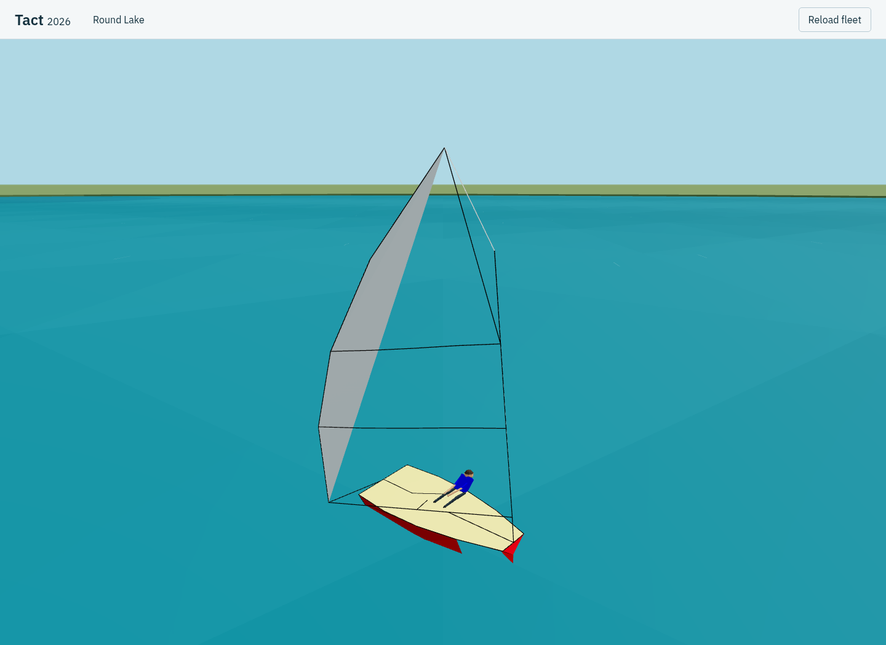
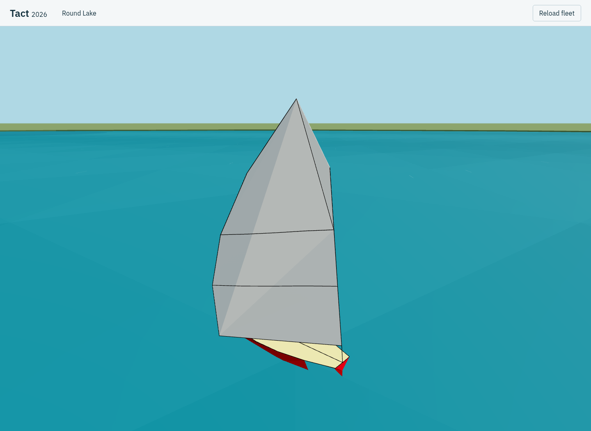

# Optimist sail surface repair

The missing panels came from triangulating the recovered 3D main-sail contour
through the fixed 35-degree historical painter projection. A curved or luffing
sail can overlap itself in that projection. Earcut then emits an incomplete
fill even though the native contour and outline remain intact. Double-sided
materials were already enabled; this was missing geometry.

Mains now triangulate in cloth coordinates defined by their native tack, clew
and head. The basis follows the sail as the boom changes angle. Native contour
positions, outline rods, palette, boom and luffing motion remain unchanged.
The change applies to the shared main-sail renderer; other drawing primitives
keep their existing triangulation. Simulation and private extraction are unchanged.

The reproduced Optimist luff case previously emitted five triangles and filled
3.40 of 20.18 square units in the foot/head plane, about 17% of the sail. The
fixed actual mesh emits seven triangles and fills the entire contour. The
comparison image reconstructs the old fill on the same native contour and
keeps the rest of the mesh, rather than changing simulation state.

[Chrome geometry evaluation](optimist-sail-final/verification.json) passes:

- Actual main-mesh fill checks for all 27 native classes in their default states.
- Six original private rig fixtures each for Optimist and Keelboat: normal,
  trim, luffing/opposite tack, penalty and the declared extra rig cases.
- 432 Optimist geometry yaw rotations and 24 camera views across six fixtures.
- Native black penalty colour and unchanged whole simulation boundary per class.

One small regression test retains the captured Optimist luff contour and checks
complete coverage through 72 orientations. [Wind-motion regression](optimist-wind-regression/verification.json)
also passes: the unloaded sail moves while the mast, hull and crew stay anchored;
the loaded shape stays fixed, and the native simulation boundary is unchanged.
Production build/type checking and [frozen-reference verification](optimist-reference.json)
pass (6,471 files).

[Two supplemental headed Chrome runs](optimist-render-regression/verification.json)
pass the existing 15-Keelboat reference workload with active guides and All names:
median changed frame interval 16.7ms, worst P95 16.8ms and worst P99 25.0ms.
Camera, presentation-size and geometry budgets also pass. This checks the shared
renderer after the repair, rather than claiming an Optimist performance series.
WebGPU requests used WebGL 2 fallback on this machine.

The fixtures and rotations do not certify every naturally occurring race/rig
combination or physical Pixel 11 behavior.
